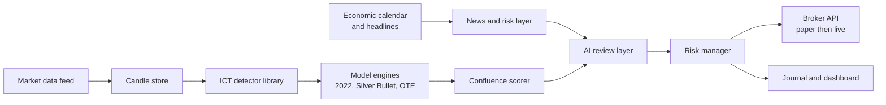

# ICT Trading System: Research and Build Plan

Ryan Kenaope · as of 2026-09-20

> Collected from the *profile projects* Claude project. Source doc: <https://claude.ai/artifact/N1REywcnzpx8QtRpj8d3A6>

## Scope and reality check

The system turns ICT's discretionary teaching into explicit rules, tests whether they have an edge, and only then lets an AI layer assist decisions. No model can guarantee "the right trading decision"; the realistic target is a positive expectancy strategy with controlled drawdown, proven out of sample.

- ICT concepts are taught visually and loosely. Every concept here gets one precise, codeable definition; where ICT is ambiguous, the choice is logged as a parameter to test.
- The AI layer is a filter and explainer, not an oracle. Large language models are poor at reading exact price levels from images, so price logic lives in deterministic code and the AI works on structured outputs and news.
- News is used to avoid or contextualise trades around scheduled releases, not to predict headlines.
- Live money comes last, after backtest, walk forward and paper trading gates are passed.
- This plan is an engineering and research document, not financial advice. Leveraged trading carries a high risk of loss.

Facts about ICT's teaching below are drawn from general knowledge of his public material, not fetched sources; treat session times and model details as approximate until checked against his videos.

## ICT concept library

Each concept becomes a detector function that returns zones or events with timestamps, so every model below is built from the same tested parts.

| Concept | Codeable definition | Parameters to test |
| --- | --- | --- |
| Swing high / low | Candle high (low) greater (less) than N candles either side | N = 1, 2, 3 |
| Buy / sell side liquidity | Unswept swing highs (lows); equal highs (lows) within a tolerance | tolerance in ticks or ATR fraction |
| Liquidity sweep | Wick trades beyond a liquidity level, body closes back inside | close back within K candles |
| Break of structure | Close beyond the last swing in the trend direction | close vs wick |
| Market structure shift | Close beyond the last opposing swing after a sweep, with displacement | swing size, displacement filter |
| Displacement | Candle body at least X times ATR(14), small wicks | X = 1.2 to 2.0 |
| Fair value gap | Candle 1 high below candle 3 low (bullish), inverse for bearish | minimum gap in ATR |
| Inversion FVG | FVG that price closes through; then treated as opposite polarity | invalidation rule |
| Order block | Last opposing candle before a displacement leg that breaks structure | mean threshold 50% |
| Breaker block | Order block that failed after a sweep; retested from the other side | retest window |
| Mitigation block | Failed swing without a sweep; retested from the other side | retest window |
| Premium / discount | Above / below 50% of the current dealing range | range definition |
| Optimal trade entry | Retracement into 62% to 79% of the impulse leg, 70.5% as sweet spot | fib anchors |
| Balanced price range | Overlapping opposing FVGs | none |
| Volume imbalance / gap | Body to body gap between consecutive candles | minimum size |
| Draw on liquidity | Nearest unmitigated higher timeframe target: old high/low, FVG, PD array | timeframe hierarchy |
| Daily bias | Direction toward the higher timeframe draw on liquidity | rule set, see strategy |
| New week / day opening gap | Gap between Friday close and Sunday open; midnight open level | none |
| Standard deviation projections | Projections of the manipulation leg at 2 to 4 multiples | multiples |
| SMT divergence | Correlated pair makes a new high/low while the other fails to | pair list, lookback |

## ICT trading models

Six models are encoded as separate strategies sharing the concept library, so each can be tested and ranked on its own before any are combined.

| Model | Sequence | Entry | Stop | Target |
| --- | --- | --- | --- | --- |
| 2022 Mentorship model | Sweep of liquidity, displacement with MSS, FVG forms | Limit at FVG | Beyond sweep extreme | Opposing liquidity |
| Silver Bullet | Inside a one hour window, sweep then FVG toward draw on liquidity | Limit at first FVG in window | Beyond FVG origin swing | Nearest liquidity, minimum 2R |
| Optimal trade entry | HTF bias, impulse leg, retracement into 62% to 79% | Limit at 70.5% | Beyond leg origin | Leg extension or liquidity |
| Power of Three (AMD) | Accumulation in Asia, manipulation against bias at London or NY open, distribution with bias | After manipulation MSS | Beyond manipulation extreme | Daily range projection |
| Judas swing | False move from midnight open against bias, then reversal | FVG or OB after reversal | Beyond Judas extreme | Previous day high or low |
| Turtle Soup | Sweep of an obvious prior high/low that fails | On close back inside | Beyond sweep wick | Opposite side of range |

Market maker buy and sell models are treated as higher timeframe context rather than entries, because they span days and are hard to define without hindsight.

## Sessions, kill zones and news

All times are stored in New York time because ICT defines everything there; Gaborone is 6 hours ahead during US daylight saving and 7 hours ahead otherwise, so the engine converts, never hard codes.

| Window | New York time | Gaborone (UTC+2, US summer) | Use |
| --- | --- | --- | --- |
| Asian range | 20:00 to 00:00 | 02:00 to 06:00 | Build range; accumulation |
| Midnight open | 00:00 | 06:00 | Daily reference level |
| London kill zone | 02:00 to 05:00 | 08:00 to 11:00 | Manipulation, Judas swing |
| London Silver Bullet | 03:00 to 04:00 | 09:00 to 10:00 | Silver Bullet entries |
| New York AM kill zone | 07:00 to 10:00 | 13:00 to 16:00 | Main session; news at 08:30 |
| NY AM Silver Bullet | 10:00 to 11:00 | 16:00 to 17:00 | Silver Bullet entries |
| London close | 10:00 to 12:00 | 16:00 to 18:00 | Retracements, exits |
| NY PM Silver Bullet | 14:00 to 15:00 | 20:00 to 21:00 | Silver Bullet entries |
| Algorithmic macros | xx:50 to xx:10 | same offset | Short delivery windows, test only |

News rules:

- Pull a high impact economic calendar (CPI, NFP, FOMC, GDP, PMI, central bank speeches) daily with actual, forecast and previous values.
- No new entries from 15 minutes before to 15 minutes after a high impact release; FOMC days flagged separately because ICT treats 14:00 and the press conference differently.
- Post release, the surprise (actual minus forecast) is stored as a feature so the backtest can learn whether it matters.
- Headlines and current affairs feed a sentiment and risk flag from the AI layer; they can block trades, never trigger them alone.

Instruments to start: EUR/USD, GBP/USD, and index futures NQ and ES, because ICT's material is centred on them and SMT needs correlated pairs (EUR/USD vs GBP/USD, NQ vs ES).

## News event module

News trading runs as its own strategy with two playbooks, directional and spike correction, kept separate from the ICT models so each is tested on its own record.

**Data.** Per event: currency, impact level, time, forecast, previous, actual, and revisions to previous, as displayed on Forex Factory. Forex Factory has no official API and its terms restrict scraping, so use its weekly calendar export for live data and a licensed or open historical calendar for backtests.

**Playbook A: directional.** Before release, the expected direction is the sign of forecast minus previous, weighted by the event's historical sensitivity. After release, the surprise (actual minus forecast, scaled by that event's past surprise spread) confirms or cancels. Entry only if the first 1 minute candle closes in the surprise direction with spread back to normal.

**Playbook B: spike correction.** After a spike larger than K times the pre-release ATR, wait for the spike to stall, then fade toward the spike's 50% level. In ICT terms the spike is treated as a liquidity sweep: entry after an MSS on the 1 minute chart and a return into the FVG left by the spike. Stop beyond the spike extreme; target 50% retracement, then the pre-release price.

**Filters to test.**

- Surprise size: small surprises favour correction, large surprises favour continuation.
- Surprise direction versus daily bias: fades against bias may fail more often.
- Event tier: NFP, CPI and FOMC behave differently to PMI or retail sales; track each separately.
- Revisions: a strong actual with a large downward revision to previous often reverses.
- Spread and slippage: modelled at 3 to 5 times normal for the first 60 seconds.

Pass the same validation gates as the ICT models, with at least 50 occurrences per event type before trusting its statistics.

## Timeframe stack and sweep to sweep

All analysis runs on a 4h, 1h, 15m, 1m stack built by resampling 1 minute data, and each timeframe acts only inside the zone set by the one above it.

| Timeframe | Job | Engine check |
| --- | --- | --- |
| 4h | Bias and draw on liquidity | Nearest unswept pool, premium or discount, structure direction |
| 1h | Narrative and PD arrays | 1h FVG or order block on the path to the draw |
| 15m | Setup | Sweep and MSS in a kill zone, in 4h direction, at a 1h array |
| 1m | Entry | First FVG after displacement |

The engine may only read higher timeframe candles that have closed; lookahead is the main source of false ICT backtest results. Alternative stacks (Daily, 1h, 5m and 1h, 5m, 1m) are tested as a control.

**Sweep to sweep model.** Price moves from one liquidity pool to the opposing one (external to internal range liquidity). After sweep one and an MSS, the target is just before the nearest unswept opposing pool, with partials at internal FVGs. When that pool is swept, the runner closes and the engine watches for a reverse setup, chaining trades. Test the hit rate by distance in ATR, and whether chained reverse trades add edge.

## Strategy specification

The core strategy is a top down, session gated 2022 model with Silver Bullet timing: daily bias from the higher timeframe, entry only after a sweep and MSS inside a kill zone, targeting the opposing liquidity.

1. **Daily bias (before London).** On the 4 hour chart, identify the nearest unmitigated draw on liquidity. Bias is long if price is in discount and the draw is above; short if in premium and the draw is below; otherwise no trade that day.
2. **Session levels.** Mark Asian high and low, previous day high and low, midnight open, and any new week opening gap.
3. **News gate.** Skip the window if a high impact release falls inside it, per the news rules.
4. **Setup (15 minute, at a 1 hour PD array).** Inside a kill zone, wait for a sweep of Asian or previous session liquidity against the bias, followed by displacement and an MSS in the bias direction.
5. **Confluence score.** Add points for SMT divergence at the sweep, FVG overlapping OTE zone, sweep at a higher timeframe level, and entry within a Silver Bullet hour. Minimum score is a tested parameter.
6. **Entry (1 minute).** Limit order at the first FVG formed by the displacement; cancel if not filled within the window.
7. **Stop.** Beyond the sweep extreme plus a buffer of 0.1 × ATR.
8. **Targets.** Partial at 2R or the first internal liquidity; runner to the next opposing liquidity pool, closed when that pool is swept; move stop to break even after the partial.
9. **Invalidation.** Close back through the MSS level before fill cancels the setup; one loss per session ends that session.

## System architecture

Price logic is deterministic Python; the AI layer only sees structured setups and news, and every decision is logged with its reasons.

The detector library feeds every model, and nothing reaches the broker without passing the risk manager.

| Component | Choice | Reason |
| --- | --- | --- |
| Language | Python 3.12 | pandas, numpy, vectorbt and backtesting libraries |
| Data | Broker or vendor 1 minute OHLC, stored in Parquet or TimescaleDB | Fast resampling to every timeframe |
| Backtester | Event driven, bar by bar, no lookahead | ICT rules depend on order of events |
| AI layer | LLM via API with structured JSON input: setup, levels, calendar, headlines | Returns take, skip or reduce size, with a written reason |
| Chart vision | Optional: rendered chart image sent for a second opinion only | Vision is weak on exact prices; never a sole trigger |
| Broker | OANDA or similar for forex; futures broker API for NQ and ES | Paper trading accounts available |
| Dashboard | Web app showing annotated charts, zones and the journal | Doubles as the portfolio showcase |
| Security | API keys in a secrets manager, never in code; order size hard caps server side | Protects the account from bugs |

A later machine learning step can train a classifier on logged setup features to predict which setups win, but only once there are several hundred labelled trades.

## Backtesting and validation

A model advances only if it passes every gate below on data it was not tuned on.

1. **Detector checks.** Hand label 100 charts per concept; the detector must agree with your labels at least 90% of the time.
2. **In sample backtest.** Three years of 1 minute data, with spread, commission and 1 tick slippage included.
3. **Walk forward.** Tune on 12 months, test on the next 3, roll forward; report only out of sample results.
4. **Robustness.** Results must survive small parameter changes and Monte Carlo reshuffling of trade order.
5. **Paper trading.** At least 3 months or 100 trades live on a demo account, results within the backtest's expected range.
6. **Small live.** Minimum position size for 3 further months before any scaling.

Pass criteria: profit factor above 1.3, expectancy above 0.2R per trade, maximum drawdown below 15%, and at least 200 out of sample trades. Report the number of parameter combinations tried, since testing many ICT variants inflates the chance of a lucky result.

## Risk management

Risk is fixed per trade and capped per day, enforced in code the AI layer cannot override.

- 0.5% of account risked per trade during testing, maximum 1% once proven.
- Maximum 2 trades per day and 2% daily loss limit; trading stops for the day when hit.
- 6% weekly drawdown pauses the system for review.
- ICT models stand aside during high impact news windows; only the news module trades them, at half normal risk. No entries while spread exceeds 2 times normal.
- Position size calculated from stop distance, never adjusted by the AI upward.
- Kill switch in the dashboard that flattens all positions and halts orders.

## Council verdict

The council's answer: build the rule engine and backtester first, ship it as a portfolio piece, and treat the AI decision layer as a later filter that must earn its place with data.

Question put to the council: should Ryan build an all in one ICT tool with an AI that reads charts and news and makes trading decisions, given limited time and capital and a need for income?

| Advisor | Position |
| --- | --- |
| Contrarian | ICT has no verified track record; "all of ICT" means dozens of loosely defined rules, a perfect recipe for overfitting. An AI making decisions on untested concepts risks real money on a guess. |
| First Principles | The real question is whether any ICT rule has an edge. That needs a detector and a backtester, not an AI. Answer it first. |
| Expansionist | A clean ICT detector library with annotated charts is rare and in demand; it could become an indicator product, a signal dashboard, or a showcase that wins freelance fintech work. |
| Outsider | "AI that makes the right decisions" sounds like every scam trading bot. A visible, honest journal of tested results is what would make anyone trust it. |
| Executor | Monday: download EUR/USD 1 minute data, code swing points, FVGs and sweeps, and plot them. Silver Bullet backtest by week 4. Nothing else until then. |

**Where they agree.** Deterministic detectors and honest backtesting come before any AI; the project has strong portfolio value regardless of trading results.

**Where they clash.** The Expansionist wants to productise early; the Contrarian wants no money near it until proven. Resolution: productise the analysis tool, not the signals.

**Blind spots caught.** Time cost against paid client work; data costs for futures; and the risk that selling signals in Botswana may need regulatory checks with NBFIRA before any public offering.

**First step.** Build the swing point, FVG and liquidity sweep detectors on EUR/USD and verify them against 100 hand marked charts.

## Autonomous operation

The system can run without user input once it passes the validation gates, but autonomy means it follows tested rules and protects itself; it cannot guarantee profit.

- **Hosting.** A VPS near the broker's servers (London or New York), running the engine as a service that restarts on failure.
- **Daily loop.** Before Asia: pull calendar, compute 4h bias and levels. During kill zones: scan every closed 1 minute candle, place and manage orders. After New York: journal trades and send a summary.
- **Self monitoring.** Heartbeat checks, broker connection checks, and a halt if live results drift outside the backtest's expected range (for example 8 consecutive losses or drawdown beyond the worst backtest case).
- **Alerts.** Telegram or WhatsApp messages for fills, exits, halts and errors, so hands off never means blind.
- **Retraining.** Parameters re-tuned quarterly by walk forward; changes deployed only if they beat the current version out of sample.
- **Human override.** Kill switch always available; any halt requires a manual restart.

## Build roadmap

Six phases over roughly six months part time, each ending in something demonstrable.

| Phase | Weeks | Deliverable |
| --- | --- | --- |
| 1. Data and detectors | 1 to 3 | 1 minute data pipeline; swing, FVG, sweep, MSS, order block detectors; annotated chart plots |
| 2. First model | 4 to 6 | Silver Bullet backtest with costs; results report |
| 3. Full model set | 7 to 12 | 2022 model, OTE, Power of Three, Judas swing, Turtle Soup; walk forward results ranked |
| 4. News and AI layer | 13 to 16 | Calendar gate, headline risk flag, LLM review returning take, skip or reduce with reasons |
| 5. Dashboard and paper trading | 17 to 22 | Web dashboard, journal, demo account execution |
| 6. Decision | 23 onwards | Go live small only if gates pass; publish the case study either way |

- [ ] Choose data source and first instrument
- [ ] Set up repo on GitHub (also fills the missing portfolio link)
- [ ] Code and verify the first three detectors
