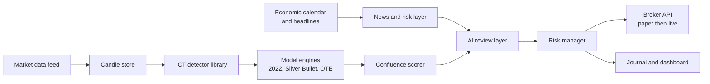

# ICT Trading System: Complete Project Record

Owner: Ryan Kenaope
Planned: 20 September 2026 · Build record updated: 23 September 2026

This file brings together the conversation summary, the agreed outcomes, the full research and build plan, the automation design and the Claude Code handoff brief.

**Parts 1 to 5 are the plan as it was agreed, and are left as written.** They are the record of what was intended, which is worth keeping separable from what was done. [Part 6](#part-6-what-was-built) is the build record: what exists, where it departed from the plan and why, and what the plan got wrong.

Short version: every phase of the roadmap is built and the code is essentially finished. None of it has run against real market data, and the first validation gate has not started, so nothing here is yet evidence about the market.

This is an engineering and research record, not financial advice. Leveraged trading carries a high risk of loss.

---

# Part 1: Conversation Summary and Outcomes

## Starting point

The trading project was already listed on Ryan's `ryan.php` portfolio page as "Options Pricing and Algorithmic Trading", an independent study from 2025 onwards, combining options pricing models with a rules based strategy built on technical analysis and ICT concepts. The open gap was a missing repository link.

## About ICT

ICT is the Inner Circle Trader, Michael J. Huddleston, known for free YouTube mentorships and a large following in retail forex and futures. His core concepts are liquidity, market structure shift, order blocks, fair value gaps, premium and discount, optimal trade entry, kill zones, the Silver Bullet and the Power of Three. He has no independently verified long term track record, and critics argue many concepts rename older ideas such as supply and demand and Wyckoff. Because his teaching is discretionary, the project's real value is turning it into precise, testable rules.

## What was asked

Build a trading tool covering all ICT concepts, with an AI model that reads charts and makes trading decisions using news, current affairs and ICT price models, supported by research and a council style decision process.

## Outcomes agreed

1. **Honest scope.** No model can guarantee correct decisions or profit. The target is a positive expectancy strategy with controlled drawdown, proven out of sample.
2. **Rules before AI.** Price logic is deterministic Python. The AI layer reviews structured setups and news and may only skip or reduce a trade, never enlarge or trigger one.
3. **Full ICT concept library** with codeable definitions and testable parameters.
4. **Six ICT models** encoded separately: 2022 Mentorship model, Silver Bullet, Optimal Trade Entry, Power of Three, Judas swing and Turtle Soup, plus the sweep to sweep model.
5. **Timeframe stack:** 4h bias, 1h PD arrays, 15m setup, 1m entry, all built from 1 minute data with strict no lookahead rules.
6. **Sweep to sweep model:** after one liquidity pool is swept, target the opposing pool; close the runner when it is swept and watch for a reverse setup.
7. **News event module** based on Ryan's own Forex Factory style trading, with a directional playbook and a spike correction playbook. Forex Factory has no official API and restricts scraping, so its weekly export is used for live data and a separate historical calendar for backtests.
8. **Session and kill zone schedule** stored in New York time and converted for Gaborone.
9. **Strict validation gates** before any live money: detector checks, backtest with costs, walk forward, robustness, paper trading, then small live.
10. **Risk rules in code** that the AI cannot override.
11. **Council verdict:** build the rule engine and backtester first, ship it as a portfolio piece, and treat the AI decision layer as a later filter that must earn its place with data.
12. **Autonomous operation** on a VPS with a daily loop, self monitoring, alerts and a kill switch.
13. **Handoff to Claude Code** for Phase 1 through a `CLAUDE.md` brief.

---

# Part 2: Research and Build Plan

## Scope and reality check

The system turns ICT's discretionary teaching into explicit rules, tests whether they have an edge, and only then lets an AI layer assist decisions. No model can guarantee the right trading decision; the realistic target is a positive expectancy strategy with controlled drawdown, proven out of sample.

- ICT concepts are taught visually and loosely. Every concept here gets one precise, codeable definition; where ICT is ambiguous, the choice is logged as a parameter to test.
- The AI layer is a filter and explainer, not an oracle. Large language models are poor at reading exact price levels from images, so price logic lives in deterministic code and the AI works on structured outputs and news.
- News is used to avoid, contextualise or trade scheduled releases through a dedicated module, not to predict headlines.
- Live money comes last, after backtest, walk forward and paper trading gates are passed.

Facts about ICT's teaching are drawn from general knowledge of his public material, not fetched sources; treat session times and model details as approximate until checked against his videos.

## ICT concept library

Each concept becomes a detector function that returns zones or events with timestamps, so every model is built from the same tested parts.

| Concept | Codeable definition | Parameters to test |
| --- | --- | --- |
| Swing high / low | Candle high (low) greater (less) than N candles either side | N = 1, 2, 3 |
| Buy / sell side liquidity | Unswept swing highs (lows); equal highs (lows) within a tolerance | tolerance in ticks or ATR fraction |
| Liquidity sweep | Wick trades beyond a liquidity level, body closes back inside | close back within K candles |
| Break of structure | Close beyond the last swing in the trend direction | close vs wick |
| Market structure shift | Close beyond the last opposing swing after a sweep, with displacement | swing size, displacement filter |
| Displacement | Candle body at least X times ATR(14), small wicks | X = 1.2 to 2.0 |
| Fair value gap | Candle 1 high below candle 3 low (bullish), inverse for bearish | minimum gap in ATR |
| Inversion FVG | FVG that price closes through; then treated as opposite polarity | invalidation rule |
| Order block | Last opposing candle before a displacement leg that breaks structure | mean threshold 50% |
| Breaker block | Order block that failed after a sweep; retested from the other side | retest window |
| Mitigation block | Failed swing without a sweep; retested from the other side | retest window |
| Premium / discount | Above / below 50% of the current dealing range | range definition |
| Optimal trade entry | Retracement into 62% to 79% of the impulse leg, 70.5% as sweet spot | fib anchors |
| Balanced price range | Overlapping opposing FVGs | none |
| Volume imbalance / gap | Body to body gap between consecutive candles | minimum size |
| Draw on liquidity | Nearest unmitigated higher timeframe target: old high/low, FVG, PD array | timeframe hierarchy |
| Daily bias | Direction toward the higher timeframe draw on liquidity | rule set, see strategy |
| New week / day opening gap | Gap between Friday close and Sunday open; midnight open level | none |
| Standard deviation projections | Projections of the manipulation leg at 2 to 4 multiples | multiples |
| SMT divergence | Correlated pair makes a new high/low while the other fails to | pair list, lookback |

## ICT trading models

Each model is encoded as a separate strategy sharing the concept library, so each can be tested and ranked on its own before any are combined.

| Model | Sequence | Entry | Stop | Target |
| --- | --- | --- | --- | --- |
| 2022 Mentorship model | Sweep of liquidity, displacement with MSS, FVG forms | Limit at FVG | Beyond sweep extreme | Opposing liquidity |
| Silver Bullet | Inside a one hour window, sweep then FVG toward draw on liquidity | Limit at first FVG in window | Beyond FVG origin swing | Nearest liquidity, minimum 2R |
| Optimal trade entry | HTF bias, impulse leg, retracement into 62% to 79% | Limit at 70.5% | Beyond leg origin | Leg extension or liquidity |
| Power of Three (AMD) | Accumulation in Asia, manipulation against bias at London or NY open, distribution with bias | After manipulation MSS | Beyond manipulation extreme | Daily range projection |
| Judas swing | False move from midnight open against bias, then reversal | FVG or OB after reversal | Beyond Judas extreme | Previous day high or low |
| Turtle Soup | Sweep of an obvious prior high/low that fails | On close back inside | Beyond sweep wick | Opposite side of range |

Market maker buy and sell models are treated as higher timeframe context rather than entries, because they span days and are hard to define without hindsight.

## Sessions, kill zones and news

All times are stored in New York time because ICT defines everything there; Gaborone is 6 hours ahead during US daylight saving and 7 hours ahead otherwise, so the engine converts and never hard codes.

| Window | New York time | Gaborone (UTC+2, US summer) | Use |
| --- | --- | --- | --- |
| Asian range | 20:00 to 00:00 | 02:00 to 06:00 | Build range; accumulation |
| Midnight open | 00:00 | 06:00 | Daily reference level |
| London kill zone | 02:00 to 05:00 | 08:00 to 11:00 | Manipulation, Judas swing |
| London Silver Bullet | 03:00 to 04:00 | 09:00 to 10:00 | Silver Bullet entries |
| New York AM kill zone | 07:00 to 10:00 | 13:00 to 16:00 | Main session; news at 08:30 |
| NY AM Silver Bullet | 10:00 to 11:00 | 16:00 to 17:00 | Silver Bullet entries |
| London close | 10:00 to 12:00 | 16:00 to 18:00 | Retracements, exits |
| NY PM Silver Bullet | 14:00 to 15:00 | 20:00 to 21:00 | Silver Bullet entries |
| Algorithmic macros | xx:50 to xx:10 | same offset | Short delivery windows, test only |

News rules:

- Pull a high impact economic calendar (CPI, NFP, FOMC, GDP, PMI, central bank speeches) daily with actual, forecast and previous values.
- ICT models make no new entries from 15 minutes before to 15 minutes after a high impact release; FOMC days are flagged separately.
- Post release, the surprise (actual minus forecast) is stored as a feature so the backtest can learn whether it matters.
- Headlines and current affairs feed a sentiment and risk flag from the AI layer; they can block trades, never trigger them alone.

Instruments to start: EUR/USD, GBP/USD, and index futures NQ and ES, because ICT's material is centred on them and SMT needs correlated pairs (EUR/USD vs GBP/USD, NQ vs ES).

## News event module

News trading runs as its own strategy with two playbooks, directional and spike correction, kept separate from the ICT models so each is tested on its own record.

**Data.** Per event: currency, impact level, time, forecast, previous, actual, and revisions to previous, as displayed on Forex Factory. Forex Factory has no official API and its terms restrict scraping, so use its weekly calendar export for live data and a licensed or open historical calendar for backtests.

**Playbook A: directional.** Before release, the expected direction is the sign of forecast minus previous, weighted by the event's historical sensitivity. After release, the surprise (actual minus forecast, scaled by that event's past surprise spread) confirms or cancels. Entry only if the first 1 minute candle closes in the surprise direction with spread back to normal.

**Playbook B: spike correction.** After a spike larger than K times the pre-release ATR, wait for the spike to stall, then fade toward the spike's 50% level. In ICT terms the spike is treated as a liquidity sweep: entry after an MSS on the 1 minute chart and a return into the FVG left by the spike. Stop beyond the spike extreme; target 50% retracement, then the pre-release price.

**Filters to test.**

- Surprise size: small surprises favour correction, large surprises favour continuation.
- Surprise direction versus daily bias: fades against bias may fail more often.
- Event tier: NFP, CPI and FOMC behave differently to PMI or retail sales; track each separately.
- Revisions: a strong actual with a large downward revision to previous often reverses.
- Spread and slippage: modelled at 3 to 5 times normal for the first 60 seconds.

The news module passes the same validation gates as the ICT models, with at least 50 occurrences per event type before trusting its statistics.

## Timeframe stack and sweep to sweep

All analysis runs on a 4h, 1h, 15m, 1m stack built by resampling 1 minute data, and each timeframe acts only inside the zone set by the one above it.

| Timeframe | Job | Engine check |
| --- | --- | --- |
| 4h | Bias and draw on liquidity | Nearest unswept pool, premium or discount, structure direction |
| 1h | Narrative and PD arrays | 1h FVG or order block on the path to the draw |
| 15m | Setup | Sweep and MSS in a kill zone, in 4h direction, at a 1h array |
| 1m | Entry | First FVG after displacement |

The engine may only read higher timeframe candles that have closed; lookahead is the main source of false ICT backtest results. Alternative stacks (Daily, 1h, 5m and 1h, 5m, 1m) are tested as a control.

**Sweep to sweep model.** Price moves from one liquidity pool to the opposing one (external to internal range liquidity). After sweep one and an MSS, the target is just before the nearest unswept opposing pool, with partials at internal FVGs. When that pool is swept, the runner closes and the engine watches for a reverse setup, chaining trades. Test the hit rate by distance in ATR, and whether chained reverse trades add edge.

## Strategy specification

The core strategy is a top down, session gated 2022 model with Silver Bullet timing: bias from the higher timeframe, entry only after a sweep and MSS inside a kill zone, targeting the opposing liquidity.

1. **Daily bias (before London).** On the 4 hour chart, identify the nearest unmitigated draw on liquidity. Bias is long if price is in discount and the draw is above; short if in premium and the draw is below; otherwise no trade that day.
2. **Session levels.** Mark Asian high and low, previous day high and low, midnight open, and any new week opening gap.
3. **News gate.** Skip the window if a high impact release falls inside it, per the news rules.
4. **Setup (15 minute, at a 1 hour PD array).** Inside a kill zone, wait for a sweep of Asian or previous session liquidity against the bias, followed by displacement and an MSS in the bias direction.
5. **Confluence score.** Add points for SMT divergence at the sweep, FVG overlapping the OTE zone, sweep at a higher timeframe level, and entry within a Silver Bullet hour. Minimum score is a tested parameter.
6. **Entry (1 minute).** Limit order at the first FVG formed by the displacement; cancel if not filled within the window.
7. **Stop.** Beyond the sweep extreme plus a buffer of 0.1 × ATR.
8. **Targets.** Partial at 2R or the first internal liquidity; runner to the next opposing liquidity pool, closed when that pool is swept; move stop to break even after the partial.
9. **Invalidation.** Close back through the MSS level before fill cancels the setup; one loss per session ends that session.

## System architecture

Price logic is deterministic Python; the AI layer only sees structured setups and news, and every decision is logged with its reasons.

The detector library feeds every model, and nothing reaches the broker without passing the risk manager.

| Component | Choice | Reason |
| --- | --- | --- |
| Language | Python 3.12 | pandas, numpy, vectorbt and backtesting libraries |
| Data | Broker or vendor 1 minute OHLC, stored in Parquet or TimescaleDB | Fast resampling to every timeframe |
| Backtester | Event driven, bar by bar, no lookahead | ICT rules depend on order of events |
| AI layer | LLM via API with structured JSON input: setup, levels, calendar, headlines | Returns take, skip or reduce size, with a written reason |
| Chart vision | Optional: rendered chart image sent for a second opinion only | Vision is weak on exact prices; never a sole trigger |
| Broker | OANDA or similar for forex; futures broker API for NQ and ES | Paper trading accounts available |
| Dashboard | Web app showing annotated charts, zones and the journal | Doubles as the portfolio showcase |
| Security | API keys in a secrets manager, never in code; order size hard caps server side | Protects the account from bugs |

A later machine learning step can train a classifier on logged setup features to predict which setups win, but only once there are several hundred labelled trades.

## Backtesting and validation

A model advances only if it passes every gate below on data it was not tuned on.

1. **Detector checks.** Hand label 100 charts per concept; the detector must agree with the labels at least 90% of the time.
2. **In sample backtest.** Three years of 1 minute data, with spread, commission and 1 tick slippage included.
3. **Walk forward.** Tune on 12 months, test on the next 3, roll forward; report only out of sample results.
4. **Robustness.** Results must survive small parameter changes and Monte Carlo reshuffling of trade order.
5. **Paper trading.** At least 3 months or 100 trades on a demo account, results within the backtest's expected range.
6. **Small live.** Minimum position size for 3 further months before any scaling.

Pass criteria: profit factor above 1.3, expectancy above 0.2R per trade, maximum drawdown below 15%, and at least 200 out of sample trades. Report the number of parameter combinations tried, since testing many ICT variants inflates the chance of a lucky result.

## Risk management

Risk is fixed per trade and capped per day, enforced in code the AI layer cannot override.

- 0.5% of account risked per trade during testing, maximum 1% once proven.
- Maximum 2 trades per day and 2% daily loss limit; trading stops for the day when hit.
- 6% weekly drawdown pauses the system for review.
- ICT models stand aside during high impact news windows; only the news module trades them, at half normal risk. No entries while spread exceeds 2 times normal.
- Position size calculated from stop distance, never adjusted upward by the AI.
- No stacking of correlated trades, for example long EUR/USD and long GBP/USD together.
- Kill switch in the dashboard that flattens all positions and halts orders.

## Council verdict

The council's answer: build the rule engine and backtester first, ship it as a portfolio piece, and treat the AI decision layer as a later filter that must earn its place with data.

Question put to the council: should Ryan build an all in one ICT tool with an AI that reads charts and news and makes trading decisions, given limited time and capital and a need for income?

| Advisor | Position |
| --- | --- |
| Contrarian | ICT has no verified track record; "all of ICT" means dozens of loosely defined rules, a perfect recipe for overfitting. An AI making decisions on untested concepts risks real money on a guess. |
| First Principles | The real question is whether any ICT rule has an edge. That needs a detector and a backtester, not an AI. Answer it first. |
| Expansionist | A clean ICT detector library with annotated charts is rare and in demand; it could become an indicator product, a signal dashboard, or a showcase that wins freelance fintech work. |
| Outsider | "AI that makes the right decisions" sounds like every scam trading bot. A visible, honest journal of tested results is what would make anyone trust it. |
| Executor | Monday: download EUR/USD 1 minute data, code swing points, FVGs and sweeps, and plot them. Silver Bullet backtest by week 4. Nothing else until then. |

**Where they agree.** Deterministic detectors and honest backtesting come before any AI; the project has strong portfolio value regardless of trading results.

**Where they clash.** The Expansionist wants to productise early; the Contrarian wants no money near it until proven. Resolution: productise the analysis tool, not the signals.

**Blind spots caught.** Time cost against paid client work; data costs for futures; and the risk that selling signals in Botswana may need regulatory checks with NBFIRA before any public offering.

**First step.** Build the swing point, FVG and liquidity sweep detectors on EUR/USD and verify them against 100 hand marked charts.

## Autonomous operation

The system can run without user input once it passes the validation gates, but autonomy means it follows tested rules and protects itself; it cannot guarantee profit.

- **Hosting.** A VPS near the broker's servers (London or New York), running the engine as a service that restarts on failure.
- **Daily loop.** Before Asia: pull calendar, compute 4h bias and levels. During kill zones: scan every closed 1 minute candle, place and manage orders. After New York: journal trades and send a summary.
- **Self monitoring.** Heartbeat checks, broker connection checks, and a halt if live results drift outside the backtest's expected range (for example 8 consecutive losses or drawdown beyond the worst backtest case).
- **Alerts.** Telegram or WhatsApp messages for fills, exits, halts and errors, so hands off never means blind.
- **Retraining.** Parameters re-tuned quarterly by walk forward; changes deployed only if they beat the current version out of sample.
- **Human override.** Kill switch always available; any halt requires a manual restart.

## Build roadmap

Six phases over roughly six months part time, each ending in something demonstrable.

| Phase | Weeks | Deliverable | Built |
| --- | --- | --- | --- |
| 1. Data and detectors | 1 to 3 | 1 minute data pipeline; swing, FVG, sweep, MSS, order block detectors; annotated chart plots | Yes |
| 2. First model | 4 to 6 | Silver Bullet backtest with costs; results report | Yes |
| 3. Full model set | 7 to 12 | 2022 model, OTE, Power of Three, Judas swing, Turtle Soup, sweep to sweep; walk forward results ranked | Yes |
| 4. News and AI layer | 13 to 16 | Calendar gate, news playbooks, headline risk flag, LLM review returning take, skip or reduce with reasons | Yes |
| 5. Dashboard and paper trading | 17 to 22 | Web dashboard, journal, demo account execution | Code yes, paper trading not started |
| 6. Decision | 23 onwards | Go live small only if gates pass; publish the case study either way | Not reached |

The six phases were written as roughly six months part time. The code took days rather than months, which is not the achievement it sounds like: the code was never the constraint. See Part 6.

- [x] Choose data source and first instrument (EUR/USD forex; OANDA rather than Dukascopy, see Part 6)
- [x] Set up repo on GitHub (also fills the missing portfolio link)
- [x] Code and verify the first three detectors (coded and unit tested; *verified against hand labels* remains outstanding, and that distinction turned out to be the whole project)

---

# Part 3: How the Trading Process Is Automated

## The daily loop

1. **Pre-session prep:** 4h bias, levels, news calendar.
2. **Kill zone scanner:** runs on every closed 1 minute candle.
3. **Setup detected:** sweep, MSS, FVG, aligned timeframe stack.
4. **AI and risk checks:** news gate, limits, position size.
5. **Order to broker:** limit entry with stop and target attached.
6. **Trade management:** partials, break even, runner.
7. **Journal and alerts:** phone message and daily summary.

The scanner repeats for each kill zone. The risk checks form the safety layer and nothing in the loop can override them.

Three technical pieces make it run:

- **Scheduler:** the Python engine runs as a service on a VPS and wakes itself on a clock: prep before Asia, scanning only during kill zones, shutdown after New York.
- **Live data stream:** the broker API streams prices; each closed 1 minute candle rebuilds the 15m, 1h and 4h candles and runs the detectors.
- **Broker API:** when a setup passes the checks, the code places the order itself, then manages the position by the rules. OANDA's API supports all of this.

## Pre-session prep in detail

Runs once a day at about 19:30 New York time (01:30 in Gaborone during US summer), just before the Asian session.

1. **Refresh data.** Pull the latest 1 minute candles, fill gaps, rebuild the 15m, 1h and 4h candles.
2. **Set bias.** On the 4h, find the nearest unswept liquidity pool, check premium or discount, read structure direction. Result: long, short, or no trade today.
3. **Map the path.** Mark 1h FVGs and order blocks between current price and the draw; only these zones count for 15m setups.
4. **Mark levels.** Previous day and week highs and lows, equal highs and lows, new week opening gap, and the midnight open once it prints. Asian high and low are added when Asia closes.
5. **Load news.** Pull the day's calendar, block windows around high impact releases, flag events for the news module.
6. **Check account state.** Broker connection, balance, open positions, and whether daily or weekly loss limits are already hit.
7. **Send the plan.** A short phone message, for example: "EUR/USD bias short, draw at 1.0850, CPI at 14:30 blocks NY AM."

If bias is unclear or the account is halted, the day is marked "no trade" and the scanner stays off.

## AI and risk checks in detail

**Risk checks (code, cannot be overridden):**

- News gate: no ICT entry within 15 minutes of a high impact release.
- Loss limits: blocks if 2 trades already taken today, the 2% daily loss is hit, or the 6% weekly pause is active.
- Spread and liquidity: blocks if spread is above 2 times normal.
- Position size: calculated from stop distance so each loss equals 0.5% of the account.
- Exposure: no stacking correlated trades.

**AI review (runs only if risk checks pass):**

- Receives structured data, not a raw chart: the setup, timeframe alignment, confluence score, upcoming events and recent headlines.
- Answers take, skip or reduce size, with a written reason saved to the journal.
- Can only make a trade smaller or cancel it, never larger or earlier.

Every decision, including skipped ones, is logged. If skipped trades would have won more than they lost, the AI layer is switched off.

---

# Part 4: Claude Code Handoff Brief

The Phase 1 brief lives at the repository root as [`CLAUDE.md`](../CLAUDE.md).

---

# Part 5: Next Steps

*As written on 20 September. Steps 1, 2 and 4 are done; 3 and 5 are superseded by Part 6.*

1. Create an `ict-trading` folder, run `git init`, and add the brief as `CLAUDE.md`.
2. Open Claude Code in the folder and send: "Read CLAUDE.md and build Phase 1. Start with the data loader and resampler, then the detectors with tests."
3. Download a few months of EUR/USD 1 minute data from Dukascopy or HistData into `data/`.
4. Push the repository to GitHub and link it from the portfolio page.
5. Review the detector plots against ICT's definitions before starting the Silver Bullet backtest.

---

# Part 6: What Was Built

Updated 23 September 2026. Parts 1 to 5 above are the plan as agreed and are left as written; this part is what actually exists.

## Where the project stands

Every phase of the roadmap is built. **The code is essentially finished and the project is not.** Six validation gates stand between here and an answer, and the first one has not started.

| Gate | State |
| --- | --- |
| 1. Detectors agree with hand labels 90% | Not started. Tooling built, the labelling is manual |
| 2. Three years in sample with costs | Blocked: no real data has ever loaded |
| 3. Walk forward, out of sample only | Machinery built, run only on a random walk |
| 4. Robustness: sensitivity and Monte Carlo | Built, never run on real data |
| 5. Paper trading, 3 months or 100 trades | Built, never run |
| 6. Small live, 3 months | Not reached |

Gates 5 and 6 are six months of calendar that cannot be compressed. The realistic finish is next June if everything passes, and the realistic outcome is that gate 3 or 4 ends it sooner. That is the project working, not failing: every pessimistic assumption in the engine exists to reach that verdict cheaply.

## What exists

Forty-one modules, eighteen commands, 354 tests, eight documents. About 11,600 lines of source and 5,300 of tests.

**Detectors** (`src/ict/detectors/`). Swings, liquidity pools, sweeps, displacement, break of structure, market structure shift, fair value gaps with mitigation and inversion, order blocks, session levels. Each is a pure function returning a timestamped frame, and each has unit tests built on hand made candle sequences with known answers.

**Timeframes** (`src/ict/timeframes/`). New York aligned resampling to 15m, 1h and 4h, the session and kill zone definitions, and the lookahead guard every detector and strategy reads higher timeframe data through.

**Backtest** (`src/ict/backtest/`). Event driven engine, simulated broker, cost model, the risk limits from Part 2, the seven models, walk forward validation and the robustness gate.

**Live** (`src/ict/live/`). OANDA order adapter and the loop that drives it, reusing the backtest's detectors, models and risk manager unchanged.

**News** (`src/ict/news/`). Calendar loading, the entry gate, and the two playbooks, kept out of the ICT model registry so they can never drift into an ICT ranking.

**Review** (`src/ict/review/`). The AI layer, its three reviewers, and the audit that decides whether it keeps its job.

**Operating.** `plan.py` (the daily routine), `journal.py` (append only trade record), `alerts.py`, `dashboard.py`, `labelling.py` (the click to mark page for gate 1).

## Where the build departed from the plan

**Data source: OANDA rather than Dukascopy or HistData.** The plan named Dukascopy. It is unreachable from the build environment, and so is every other market data host tried. OANDA's v20 API solves the data problem and the execution problem with one integration, and a practice account is free and needs no deposit. This is the single most useful change to the plan.

**The kill switch is not in the dashboard.** The plan puts it there. It cannot be: the dashboard is a static file whose purpose is being sent to people, and a button that flattens an account needs a live trading token inside a shared file. `ict flatten` does the job from the command line, where the token is already in the environment and the confirmation is a person rather than a click.

**The labelling workflow was rebuilt.** The plan implied marking charts and recording the results. The first implementation asked for a timestamp read off a chart by eye and typed into a CSV, six hundred times. That is not a fifteen hour job, it is an unbounded one, and it is why gate 1 stalled. `ict label` builds one page where a click snaps to the exact candle.

**The AI review layer's constraint is enforced in the type, not the prompt.** The plan says the layer may only skip or reduce. Headlines are untrusted text from the internet going into a language model, so a prompt is not a boundary. `Verdict` clamps every answer into `[0, 1]` on construction, so the worst a successful prompt injection achieves is a skipped trade.

**The news playbooks are kept out of the model registry.** The plan says they are tested on their own record. Making that structural rather than a convention means they cannot appear in an ICT ranking by accident.

## What the plan got wrong

**The six month schedule was a coding estimate for a problem that is not coding.** Writing the system took days. The binding constraints are fifteen hours of human attention for gate 1, and six months of wall clock for gates 5 and 6. Neither moves faster with more engineering, and most of the work after Phase 2 was built while the actual blocker sat untouched.

**"Code and verify the first three detectors" treats coding and verifying as one task.** They are the whole project apart. Every detector was coded and unit tested in Phase 1; not one has been verified against a human. Every number the system has produced since rests on that gap.

**The validation gates were sound and one of them had a hole.** `score()` grouped by the charts appearing in the labels, so a chart reviewed and correctly left blank contributed nothing and every false positive on it was invisible. A detector that over-fires on exactly the quiet days would have passed a gate whose entire purpose is catching over-firing, which is the failure mode these definitions actually have. Fixed by recording reviewed charts separately.

## Bugs worth remembering

These are kept because each one would have produced a confident, wrong number.

- **Two lookahead bugs**, both caught by the property test that re-runs a backtest on truncated data and asserts finished trades do not change. One read 1 hour pools by a candle *open* time, leaking up to 59 minutes. The other mutated a pool's creation time forward when a swing joined its cluster, so pools vanished from their own past.
- **82% of Silver Bullet setups rested orders at already mitigated gaps.** A gap price has been through and left is not an imbalance.
- **A model could return a long whose stop sat above its own entry.** Risk being an absolute distance hid it.
- **Setups whose whole risk was narrower than the spread** filled at or past their own stop, booking the loss before price moved.
- **The review layer's audit counted trades the strategy would never have reached.** Blocking a trade means the loss never happens, so the session limits never trip. It read −277R against an unreviewed −26R until the counterfactual got its own risk manager.
- **`ict sample` drew the detectors' answers on the charts meant for independent labelling**, which turns the gate into a test of whether you can read the code's output.
- **An unanchored `data/` in `.gitignore` matched `src/ict/data/`**, so the loader package was never committed and a fresh clone did not import. Undetected from Phase 1 until Phase 4.
- **pandas 3 keeps NA through `astype(str)` and groupby drops NaN keys**, so 19 of 26 trades vanished from a journal breakdown without a word.

## What has actually been measured

Nothing about the market. Every result so far comes from a Gaussian random walk with no trend, no session structure, no fat tails and no liquidity, which is to say from data containing none of the behaviour these models are defined against.

The most informative result is a negative one. On 120 days of that data, turtle soup was the best model that traded; on 200 days it was the worst, at +14.49R and then −94.32R with nothing about the model changed. An ordering that does not survive a change of window is not an ordering, and it is what a model with no edge looks like when the sample is too small to tell.

Written up in [`walk-forward.md`](walk-forward.md) and [`backtest-results.md`](backtest-results.md).

## The next three things

1. **Open an OANDA practice account**, export the token, run `ict fetch`. Free, no deposit, ends the data problem permanently.
2. **Label 100 charts per concept** with `ict label`, then score with `ict verify --reviewed`. Fifteen to twenty hours. This is the only thing on the critical path and no amount of code substitutes for it.
3. **Run gates 2 to 4**, which are mostly compute.

`ict dashboard` prints all of this as a page, with each gate opening to the commands that would move it.

## Documents

| File | What it covers |
| --- | --- |
| [`labelling.md`](labelling.md) | Gate 1: how to mark charts and what the scores mean |
| [`live.md`](live.md) | The gate order, OANDA setup, and the path to a live account |
| [`news.md`](news.md) | The calendar gate, the playbooks, the review layer and its audit |
| [`operating.md`](operating.md) | The daily plan, the journal and the alerts |
| [`dashboard.md`](dashboard.md) | The dashboard, and why the kill switch is not on it |
| [`walk-forward.md`](walk-forward.md) | The seven models ranked out of sample, and why the ranking means nothing yet |
| [`backtest-results.md`](backtest-results.md) | The Phase 2 Silver Bullet run |
| [`../CLAUDE.md`](../CLAUDE.md) | The build brief and a phase by phase record of decisions |
